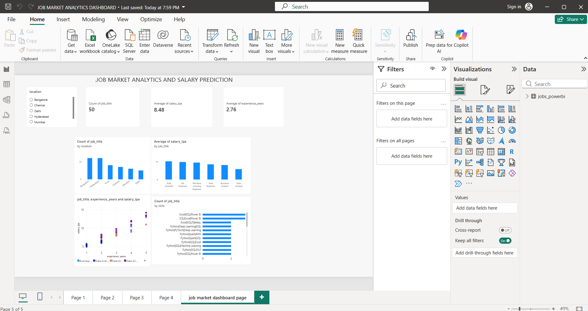

 # Job Market Analytics & Salary Prediction

## 📌 Project Overview

This project analyzes job market data and predicts salaries based on factors such as job role, location, experience, employment type, skills, and education.

The project combines Python, SQL, Machine Learning, and Power BI to create an end-to-end data analytics and salary prediction solution.

## 🎯 Objectives

- Analyze job listings by location and job role
- Understand the relationship between experience and salary
- Analyze skills mentioned in job listings
- Calculate average salaries for different job roles
- Perform SQL-based job market analysis
- Build a Machine Learning model for salary prediction
- Create an interactive Power BI dashboard

## 🛠️ Technologies Used

- Python
- Pandas
- NumPy
- Matplotlib
- Seaborn
- Scikit-learn
- SQL / SQLite
- Power BI
- Jupyter Notebook
- GitHub

## 📂 Project Structure

```text
job-market-salary-prediction/
│
├── data/
│   ├── jobs.csv
│   ├── jobs_powerbi.csv
│   └── job_market.db
│
├── dashboard/
│   └── Job_Market_Analytics_Dashboard.pbix
│
├── notebooks/
│   └── job_market_analysis.ipynb
│
├── sql/
│   └── job_analysis.sql
│
├── src/
│   └── salary_prediction_model.pkl
│
└── README.md
## Power BI Dashboard

The dashboard provides insights into job listings, salaries, experience levels, locations, and skills.

